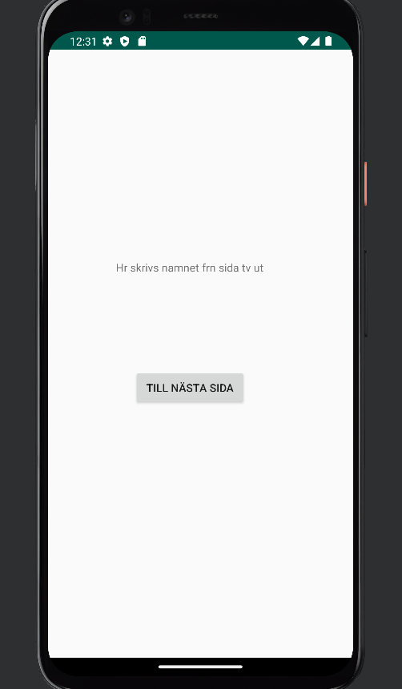

# Rapport
**Skriv din rapport här!**
För denna uppgift så gjordes två olika MainActivities, detta var då på första sida kunna skicka användaren till andra sidan, där användren ska få skriva in sitt namn, sedan visas namnet på "huvudsidan" igen.

Nedan visas kod som ger användaren en möjlighet att kunna gå vidare till nästa sida. 

button.setOnClickListener(new android.view.View.OnClickListener(){
@Override
public void onClick(View view) {
Log.d("==>", "tillbaka");
Intent intent = new Intent (MainActivity.this, MainActivity2.class);
startActivity(intent);
}
});
